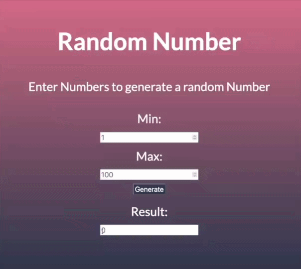

# Small Web Project Collection
## About

Some small Projects like visitor counters, Number Generators, etc.   Those projects that are to small for their own repository 

# Random Number Generator 

## About

 Enter a minimum number and maximum number to generate a random number within this interval.

## Languages
<li>HTMl</li>
<li>CSS</li>
<li>JavaScript</li>

## How to use it
1. Clone the repository 
2. Open the HTML file in your browser

### Alternativly 

The random number generator can also be used via my website:

<a href="https://theowashere.neocities.org/random_number_generator/">Random Number Generator</a>

## Preview

# Visit counter

## Abbout
Counts how many times you have clicked onto the website. Only counts the visits on the same browser
